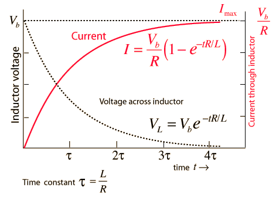

# Dispositivi elettrici

Un **dispositivo elettrico** o *componente elettrico* è un qualsiasi oggetto che ha bisogno di f.e.m. per fare qualcosa. Sono anche chiamati **componenti elettrici** se questi dispositivi sono parte di un circuito elettrico. Per motivi fisici legati alla materia di costruzione possiamo individuare in ogni dispositivo elettrico (anche nei fili!) *comportamenti di natura resistiva*, *induttiva* e *capacitiva*. Un dispositivo può essere anche un insieme di dispositivi collegati tra loro che ottemperano ad un unico obiettivo, come gli integrati.

I grandi gruppi in cui si dividono i dispositivi elettrici sono:

- **attivi** oppure **passivi**: i componenti passivi non introducono energia nel circuito e non necessitano di un'alimentazione esterna, cioè di una corrente in aggiunta al quella in ingresso. Componenti attivi, come il transistor o l'amplificatore operazionale, necessitano di una sorta di alimentazione;
- **lineari** e **non lineari**: in base alla relazione corrente-tensione che li caratterizza. La relazione corrente-tensione non è altro che un coefficente che esprime la quantità di corrente assorbita ad un certo voltaggio e viceversa; se il coefficente è sempre uguale è un dispositivo lineare;
- **n-polare**: sono divisi in base al numero di poli o nodi che i dispositivi espongono al resto del circuito. Si hanno così dispositivi *bi-polari*, *tri-polari* e così via;
- **pilotato in tensione** o **corrente**: la risposta del dispositivo varia rispettivamente in base all'entità di tensione o corrente al quale sono sottoposti.

Solitamente un dispositivo elettrico è descritto per il suo **comportamento**:

- **in regime statico** o *in statica*: comportamento che assume quando nessuna corrente in ingresso varia;
- **in regime dinamico** o *in dinamica* o *in regime transitorio*: comportamento che assume quando uno o più correnti di ingresso variano. Si tende a caratterizzare il comportamento in base alle caratteristiche dei segnali che variano. Per esempio si può parlare del consumo di un amplificatore quando deve amplificare un segnale a $30Hz$.

Un **transitorio** è il lasso di tempo in cui un dispositivo passa da uno stato ad un altro, quindi si parla di transitori soprattutto in regime dinamico.

Per studiare il comportamento di un dispositivo elettrico si fa frequentamente distinsione tra due "**versioni**", quella **ideale** e quella **reale**. Il comportamento di un dispositivo in versione ideale rispetto a quello in versione reale rimane lo stesso, ma cambiano alcuni aspetti minori dovuti da fenomeni parassiti, caratteristiche costruttive e simili.

Il **circuito di polarizzazione** di un dispositivo è un circuito che permette di utilizzare il dispositivo, che lo rende funzionale, in un determinato modo. Ci possono essere più circuiti di polarizzazione per un dispositivo, ognuno dei quali corrisponde ad un suo diverso utilizzo.

## Caratteristiche dei dispositivi elettrici

### Potenza

La **potenza** è un valore che caratterizza quasi tutti i dispositivi elettronici ed esprime il massimo di quantità di energia che un generico componente elettrico è in grado di **produrre** o **dissipare**. Se ci si riferisce ad uno specifico istante si chiama **potenza istantanea**. Si misura in Watt (W) ed $1W = \frac{1J}{1s}$.

Viste le equazioni di voltaggio e corrente possiamo dire che la potenza equivale a:

$$W=\frac{J}{s}=\frac{J}{C}\times\frac{C}{s}=VI$$

Per via dell’**effetto Joule**, per cui un dispositivo che dissipa energia lo fa sottoforma di calore, nell’elettronica odierna le potenze con cui si lavora sono sempre abbastanza ristrette; nella maggiorparte dei casi maggiore potenza significa maggiori dimensioni, che però contrastano con la tendenza a miniaturizzare sempre di più. Inolte l’effetto Joule non dipende soltanto dalla potenza da dissipare, ma anche dalle caratteristiche costruittive del prodotto: col perfezionamento delle tecnologie sempre più prodotti dissipano meno calore.

La potenza prodotta o dissipata da un dispositivo varia in base al regime di esercizio che si sta considerando, per cui possiamo parlare di **potenza statica** e **potenza dinamica**. La potenza in regimi transitori dipende da sopratutto dalle caratteristiche del componente dovute da:

- **effetti capacitivi**: ogni componente digitale rappresenta un carico capacitivo che ad ogni commutazione di quel nodo viene caricato/scaricato, determinando così una dissipazione di potenza dinamica;
- **corrente** e **frequenza di alimentazione**: le tecnologie digitali presentano correnti statiche molto basse. Infatti un circuito digitale in cui nessun nodo commuta dissipa una potenza trascurabile.

### Fenomeni parassiti

I fenomeni parassiti sono dei fenomeni che si verificano in determinate situazioni e che alterano le proprietà caratteristiche di un componente o di un materiale utilizzato in un determinato dispositivo.

## Generatore

Il generatore è un dispositivo bipolare che è in grado di creare una d.d.p., quindi una f.e.m. grazie alla sua capacità di spingere gli elettroni ad un unico polo, creando un polo a potenziale maggiore ed uno a potenziale minore.

Questa sua capacità potrebbe essere continua, come nel caso dei generatori di tensione, o deteriorarsi nel tempo, come nel caso delle pile la cui d.d.p. è creata da sostanze chimiche che si deteriorarno nel tempo.

Nel caso di correnti create da un generatore, la f.e.m. sposta gli elettroni da un'orbita all'altra: lo spazio lasciato dagli elettroni spostati è preso dagli elettroni presenti nel polo negativo della pila.

## Resistività

La **resistività** ($R$) è l'opposizione che un materiale pone ad una corrente che lo attraversa. Si misura in Ohm ($\Omega$) ed $1\Omega = \frac{1V}{1A}$. Un elemento la cui $R \to 0$, e che quindi permette il passaggio di una corrente che tende all'infinito, è detto **condutture** o *corto circuito*.

La relazione tra voltaggio e corrente è nota anche come **1° legge di Ohm**, solitamente espressa come $V = IR$.

### Resistenza

Il componente più semplice che sfrutta questa proprietà della materia è la **resistenza **o *resistore*. Queste possono avere resistenza **fissa** o **variabile**; in questo ultimo caso si indica con il simbolo (a) e, nel preciso caso in cui sia un potenziometro, con il simbolo (b). Esistono anche resistenze non lineari la cui resistività varia secondo altre regole oltre la 1° legge di Ohm.

Riguardo la *potenza* dissipata da un resistore, possiamo affidarci alla relazione:

$$W_R = VI = \frac{V^2}{R}=I^2R$$

nella realtà un resistore è caratterizzato anche dal massimo di potenza dissipabile.

#### Configurazioni note

Resistenze in:

- **serie**: $R_{eq} = \sum_{i=1}^{n} R_n$ ==TODO==: unica caduta di tensione, più correnti.
- **parallelo:** $\frac{1}{R_{eq}} = \sum_{i=1}^{n} \frac{1}{R_n}$ ma, se si tratta di solo 2 resistenze: $R_{eq} = \frac{R_1R_2}{R_1+R_2}$ ==TODO==: più cadute di tensione, corrente comune.

#### Utilizzi pratici

Le resistenze reali hanno una **potenza massima dissipabile** che va tenuta in conto quando si implementa un circuito. Le più diffuse hanno potenza massima da: 1/8W, 1/4W, 1/2W, 1W, 2W, 5W.

##### Partitore di corrente

Il partitore di corrente è un circuito che permette di ripartire la corrente passante nei rami di un circuito semplicemente mettendo delle resistenze in parallelo. La corrente passante sarà calcolabile direttamente con la legge di Ohm.

==TODO==: aggiungere spiegazione

##### Partitore di tensione

Il partitore di tensione è un circuito che permette di ottenere, in uscita, una tensione che è una frazione della tensione di alimentazione. Notando che la caduta di tensione su due resistenze in serie è proporzionale al loro valore è possibile dedurre che in una serie di resistenze la resistenza *n* avrà una caduta di tensione pari a:

$$v_n = \frac{R_n}{\sum_{i=1}^{n}R_n}v$$

==TODO==: aggiungere spiegazione

## Capacità

La **capacità** è la tendenza di un dispositivo ad immagazzinare energia. Esistono vari dispositivi che utilizzano questa proprietà, come i sensori capacitivi (esempio: touch), il condensatore, l’induttore, e così via.

### Condensatore

Il **condensatore** è un dispositivo in grado di immagazzinare e rilasciare una carica elettrica. È formato da due **armature** o *piatti* di materiale conduttore, ognuna delle quali è raggiungibile dall'esterno attraverso un terminale, separate da un **dielettrico** o *strato di isolante*. Il condensatore è un dispositivo *pilotato in tensione*.

Per comprendere il suo funzionamento si può analizzare il suo comportamento: applicando una d.d.p. ai suoi capi è possibile osservare che si instaura una corrente, che entra dal polo a potenziale maggiore ed esce dall'altro. Tale corrente sarà di *entità variabile*. Questo perché, nella realtà, la d.d.p. ai capi del condensatore "spinge" una certa quantità di elettroni in una armatura, cosicché tale piatto acquisterà una carica elettrica $-Q$, mentre "toglierà" una equivalente quantità di elettroni dall'altra armatura, che avrà quindi una carica $+Q$. Se ne deduce che, anche se da una analisi comportamentale può sembrare il contrario, **non si instaura alcura corrente tra un'armatura e l'altra**.

La precisa entità di $Q$ (ovviamente espressa in $C$) dipende da:

- caratteristiche fisiche di armature e dielettrico, tutte sintetizzate nel coefficente di **capacitanza**, espresso in Farad ($F$) tale per cui $1F = \frac{1C}{1V}$. Il farad è una unità di misura molto grande per cui, solitamente, si utilizzano i suoi sottomultipli. I condensatori nell'ordine del Farad sono chiamati **Supercap** (Super Capacitors, Super Condensatori) e sono utilizzati anche come batterie;
- dalla d.d.p a cui il condensatore è sottoposto. La tensione è l'entità della forza che sposta gli elettroni, per cui in base alla forza si riuscirà a "spingere" o "tirare" più o meno elettroni nelle due armature;
- indirettamente anche dalla *linearità del condensatore*. Un condensatore è lineare se la capacitanza del condesatore rimane sempre uguale al variare della d.d.p. ai suoi capi.

L'entità della corrente applicata al condensatore incide solo sulla velocità di carica delle armature.

#### Polarizzazione

Il circuito di polarizzazione di un condensatore è già stata sommariamente descritto; si tratta di un generatore con i poli collegati ad un condensatore. Tralasciando il tipo di generatore si possono definire i seguenti circuiti di polarizzazione:

- **polarizzazione diretta**: permette di caricare il condensatore, quindi di dare una carica alle armature;
- **polarizzazione inversa**: permette di scaricare un condensatore, cioè far tornare le armature alla stessa carica.

Analizzando nello specifico la **carica di un condensatore**, quindi l'effetto del circuito di polarizzazione diretta in cui il condensatore è posto all'improvviso ad una d.d.p. pari a $V_S$, è possibile notare che il condensatore  raggiunge una d.d.p. ai suoi capi uguale e contraria a quella del generatore. Il risultato è che la corrente circolante nel circuito diventa nulla dopo un certo periodo di tempo, che solitamente è $5\tau$ (o $5T$, come indicato nella figura sottostante).

La corrente che "attraversa" il condensatore segue un andamento parabolico, in quanto la sua entità diminuisce proporzionalmente all'innalzamento della tensione ai capi del condensatore, che è contraria a quella del generatore. Si otterrà che la polarizzazione sarà tanto più lenta quanto la tensione ai capi del condensatore sarà uguale in modulo (avrà segno opposto) a quella del generatore e che il condensatore non raggiungerà mai perfettamente $V_S$. Ma già dopo un periodo di $4\tau$ il condensatore avrà raggiunto una d.d.p. del $98\%$ di $V_S$, per cui è già praticamente carico. Il perido di $4\tau$ è chiamato **periodo di transitorio**.

$\tau = R \times C$, dove $R$ è la resistenza e $C$ la capacità del condensatore. Facendo l'analisi dimensionale si ottiene che $\Omega \times F = s$.

Se si considera invece che $V_S$ possa variare si identifica la caratteristica corrente-tensione di un condensantore come $i = C \frac{dv}{dt}$, cioè la corrente *assorbita* è pari a quanto la tensione varia nel tempo. Esempio: se la tensione aumenta di $1 \frac{V}{s}$, allora $i = C Ampere$.

#### Funzionamento in frequenza

==TODO==: Funzionamento in frequenza del condensatore e Frequenza di taglio

- vedere sti effetti parassiti dei condesatori a alte frequenze
- potenze dissipate in un transitorio 0 – 1 – 0 saranno Capacità\*VDD^2^\*Frequenza (velocità con cui abbiamo carica scarica). Quindi, alzare la frequenza indica un aumento di potenza da dissipare, e calore. Stessa cosa per l’alimentazione, per questo si è passata da TTL a 5V a batterie low-powa e logiche adatte. La resistenza consuma il 50% dell’energia, perché è appunto attraversata da corrente. Nella scarica l’altro 50% viene consumato dalla resistenza

#### Il condensatore reale

Un condensatore reale è soggeto ad un fenomeno parassita per cui si instaura una minima corrente tra le armature visto nessun dielettrico ha resistenza infinita. Questo motiva i seguenti effetti:

- **dissipazione di energia**: non tutta l'energia immagazzinata è rilasciata;
- **scarica nel tempo**: se il condensatore è scollegato perde, più o meno lentamente, la sua carica.

Tale corrente dipende dalle caratteristiche di costruzione del transistor, come la grandezza delle facce e lo spessore del dielettrico, che possono alterare la [permittività](https://it.wikipedia.org/wiki/Permittività_elettrica) del dielettrico.

Queste caratteristiche sono modellate con una resistenza messa in parallelo al condensatore chiamata **resistenza di dispersione** (o *leakage resistance*) che equivale alla resistenza opposta dal dielettrico ed è, solitamente, nell'ordine dei $100\Omega$ (==TODO==: sicuro solo 100?).

Per quanto riguarda la costruzione la possibilità di miniaturizzazione di un condensatore dipende soprattutto dal materiale usato; ad esempio quelli di oggi possono avere grandi capacità e piccoli ingombri aumentando la dimensione delle facce avvolgendole su di loro ed utilizzando dielettrici molto sottili.

#### Configurazioni note

Condensatori in:

- **serie:** $\frac{1}{C_{eq}} = \sum_{i=1}^{n} \frac{1}{C_n}$ ma, se si tratta di solo 2 condensatori: $C_{eq} = \frac{C_1C_2}{C_1+C_2}$
- **parallelo**: $C_{eq} = \sum_{i=1}^{n} C_n$

## Induttore

L'**induttore** (identificato solitamente con una $L$) è un dispositivo che immagazzina energia sottoforma di campo magnetico. L'entità di questo campo magnetico dipende dalla rapidità di variazione della corrente $i_L$ (cioè $di_L$) che attraversa l’induttore. Questa, a sua volta, instaura una tensione $v_L$ ai capi dell’induttore che genera una corrente contraria al verso di $i_L$. Per questo possiamo definire l’induttore come:

- un dispositivo *pilotato in corrente*;
- un *generatore di tensione* $v_L$, presente soltanto in situazione transitoria. Il verso della tensione prodotta, nella pratica, dipende dal tipo di variazione dell’intensità di corrente. Se questa:
  - accresce ($di_L>0$): sarà contraria al verso di $i_L$, come detto sopra;
  - decresce ($di_L<0$): sarà lo stesso di $i_L$. Questo è motivato dal fatto che una tensione che decresce equivale ad una tensione contraria che accresce.

Possiamo sintetizzare tutto ciò con la formula:

$$v_L = L\frac{di_L}{dt}$$

In caso in cui $i_L$ sia costante non vi è alcuna tensione, per cui il comportamento dell’induttore è assimilabile a quello di un normalissimo conduttore.

Il rapporto tra la corrente $i_L$ e la tensione $v_L$ è chiamata induttanza, si misura in **Henry** ($H$) e sottointende all’equazione $1H=\frac{1V}{1A/s}$ per cui, per una corrente che incrementa di $1A/s$ otteniamo una tensione ai capi dell’induttore di $1V$ per ogni Henry.

Gli Henry di un induttore dipendono dalle sue *caratteristiche fisiche*, cioè lunghezza, diametro e numero di spire, tipo di conduttore utilizzato ed anche dalla quantità e permeabilità del materiale utilizzato come nucleo; proprio quest’ultimo permette di aumentare l’effetto dell’induttanza senza aumentarne la dimensione. Per dare un’idea pratica dell’entità di un Henry, è frequente lavorare nell’ordine degli Henry e suoi multipli, in quanto è una misura abbastanza piccola.

Per via della costituzione di un solenoide si deduce che *il passaggio di corrente in un qualsiasi conduttore crea un campo magnetico*, ma non è possibile osservarlo ed utilizzarlo essendo di entità molto piccola.

Anche l’induttore è soggetto a fenomeni parassiti dovuti dal conduttore di cui è costituito. Così l’**induttore reale** presenterà delle caratteristiche di:

- **resistenza**: chiamata resistenza di avvolgimento $R_W$ e che definisce anche una corrente massima che può passare nell’induttore;
- **capacità**: causata dalla vicinanza delle spire e chiamata $C_W$;
- **perdite del nucleo**.

Sono solitamente ignorate tranne quando si lavora nel dominio delle alte frequenze, in cui si verifica il cosiddetto [effetto pelle](https://it.wikipedia.org/wiki/Effetto_pelle) o in casi di temperature abbastanza differenti dalle temperature normali.

Inoltre l’induttore, per via della sua costituzione, è sensibile a campi magnetici nelle vicinanze, per cui alcuni induttori hanno attorno una schermatura.

### Configurazioni note

Induttori in:

- **serie**: $L_{eq} = \sum_{i=1}^{n} L_n$
- **parallelo:** $\frac{1}{L_{eq}} = \sum_{i=1}^{n} \frac{1}{L_n}$ ma, se si tratta di solo 2 induttori: $L_{eq} = \frac{L_1L_2}{L_1+L_2}$

### Utilizzi pratici

==TODO==:

- Carica e Scarica di un Induttore
- Il transitorio di carica scarica di un induttore ha lo stesso
- comportamento di quello di un condensatore ma con costante
- di tempo τ = L/R.