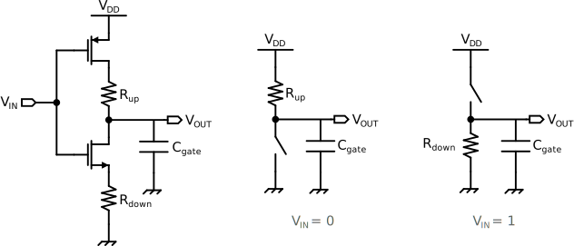

# La famiglia logica CMOS

Per **CMOS**, acronimo di *complementary symmetry MOS*, si indica la famiglia logica più utilizzata al giorno d'oggi. Symmetry suggerisce che il circuito è composto da due parti simmetriche:

- una **rete di pull-up**: un circuito logico composto da soli **pMOS**, tutti con la stessa $V_{th}^{pMOS}$ (che è negativa);
- una **rete di pull-down**: un circuito logico composto di soli **nMOS**, tutti con la stessa $V_{th}^{nMOS}$ (che è positiva).

Notare che in un circuito CMOS correttamente dimensionato le $V_{th}$ **in modulo** dei pMOS e degli nMOS sono uguali o vicine, cioè $|V_{th}^{pMOS}| \ge |V_{th}^{nMOS}|$. L'idea base della tecnologia CMOS è racchiusa proprio in tale disequazione; per provarlo possiamo analizzare il funzionamento di un invertitore CMOS.

Un **invertitore** in famiglia **CMOS** è composto da 2 MOS di arricchimento con loro $D$ collegati tra loro. Da tale collegamento si legge il segnale di output $V_{OUT}$, mentre il segnale di input $V_{IN}$ è inoltrato ai $G$ di entrambi i MOS, quindi variare $V_{GS}$ dei MOS equivale ad inoltrare un segnale all'inveritore. In base al valore di $V_{IN}$ si noteranno i seguenti casi:

-  $V_{IN} = 0 = V_{EE}$: quando l'input del circuito logico è basso la **rete di pull-up è in conduzione**, in quanto i pMOS sono in saturazione perché $V_{GS}^{pMOS} = - V_{DD}$, mentre la rete di nMOS è in interdizione in quanto $V_{GS}^{nMOS} = 0V$. Otterremo quindi che $V_{OUT} = 1 = V_{DD}$, per via del cortocircuito che si formerà tra $V_{DD}$ e $V_{OUT}$. La rete di pMOS è per l'appunto chiamata rete di "pull-up" in quanto alza l'uscita, cioè la imposta a valore logico alto;
-  $V_{IN} = 1 = V_{DD}$: quando l'input del circuito logico è alto la **rete di pull-down è in conduzione**, in quanto gli nMOS sono in saturazione perché $V_{GS}^{nMOS} = V_{DD}$, mentre la rete di pMOS è in interdizione in quanto $V_{GS}^{pMOS} = V_{DD} - V_{DD} = 0V$. Otterremo quindi che $V_{OUT} = 0 = V_{EE}$, per via del cortocircuito che si formerà tra $V_{EE}$ e $V_{OUT}$. La rete di nMOS è per l'appunto chiamata rete di "pull-down" in quanto abbassa l'uscita, cioè la imposta a valore logico basso.

## Caratteristiche

Dall'analisi del funzionamento dell'invertitore CMOS si può dedurre uno degli aspetti più importanti di tale tecnologia: in un circuito logico CMOS **non è possibile che la rete di pull-up e la rete di pull-down siano contemporaneamente in saturazione**, quindi non c'è mai un cortocircuito tra $V_{DD}$ e $V_{EE}$. L'unico momento in cui le reti possono entrambe condurre una certa corrente è durante una qualsiasi commutazione di $V_{IN}$. Questa proprietà porta come diretta conseguenza l'**annullamento del consumo statico**, quindi del consumo quando non c'è variazione del segnale $V_{IN}$. In verità non si annulla completamente visto che i MOS della rete interdetta, in verità, sono comunque attraversati da una piccolissima corrente proprio per via di un comportamento parassita del MOS. Si avrà quindi consumo soltanto in dinamica, dovuto dal cortocircuito tra $V_{DD}$ e $V_{EE}$ che si instaura durante la commutazione, quindi più veloce sarà la commutazione, minore sarà il consumo in dinamica.

Prendendo in esame il modello reale di un inverter CMOS si notano alcune componenti in più rispetto al circuito tradizionale che modellano altre caratteristiche dell'inverter. Queste componenti sono:

- il **condensatore** $C_{gate}$: tale condensatore sintetizza l'effetto delle capacità parassite dei MOS del circuito. In regime dinamico durante la commutazione da un livello logico all'altro tali MOS debbono caricarsi e scaricarsi, per cui si presenta un ritardo nella commutazione di $V_{OUT}$ rispetto alla commutazione di $V_{IN}$ e, se tali capacità sono abbastanza rilevanti, anche un aumento del tempo di commutazione. Ovviamente in base ai MOS attivi in un certo istante il valore di $C_{gate}$ varia, quindi si possono avere diversi tempi per salita e discesa di $V_{OUT}$;
- le **resistenze** $R_{up}$ ed $R_{down}$ indicano la dissipazione per effetto joule dei MOS attivi quando è attiva la rete di pull-up e la rete di pull-down, rispettivamente. Sono dovute alle resistenze presentate dai MOS delle due parti del circuito. Queste contribuiscono ad innalzare il consumo statico.

Altre proprietà:

- alta immunità al rumore. $V_{DD}$ e $V_{SS}$ non sono altro che le tensioni di riferimento rispettivamente per i valori logici 1 e 0. Questi due valori, inoltre, sono gli unici due valori che $Q$ potrà assumere, per cui si possono già eliminare, o almeno attenuare, problemi di disturbi sapendo che ogni altro valore di $Q$, al di fuori di determinati range di tolleranza, sono dovuti da malfunzionamenti del circuito.
- non soffre dell'effetto body

## Scaling

il MOS è il transistor più piccolo delle famiglie logiche, quindi con qusta tecnica si arriva al grado di miniaturizzazione più piccolo possibile, per ora.

## Note di utilizzo

In un circuito logico composto da vari circuiti CMOS capita spesso che, per diminuire la resistenza che ogni circuito introduce, di mettere **più MOS in parallelo** ove ne basterebbe soltanto uno. Questo sfrutta il principio delle resistenze in parallelo e permette di aumentare la corrente che circola senza aumentare la $V_{GS}$. È molto ultile per le linee di trasmissione.

