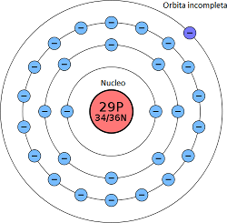
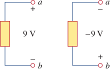
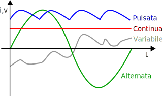
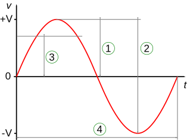

# Materia ed elettricità

Qualunque fenomeno elettrico deriva dalle forze che interagiscono tra le componenti degli atomi che compongono la materia.

## Atomi

L'elettronica si basa molto sugli **atomi**. Questi sono le particelle che compongono le molecole ma che sono, a loro volta, composte da **elettroni** che orbitano attorno ad un nucleo di protoni e neutroni (per questo sono noti anche come *elettroni satellite*). Il numero di elettroni indica il tipo di [elemento chimico](https://it.wikipedia.org/wiki/Elemento_chimico) a cui l'atomo appartiene.

Tranne i neutroni, queste particelle hanno una **carica elettrica**. Questa si misura in **Culomb** ($C$) ed $1C$ equivale alla carica di $6.24 \times 10^{18}$ elettroni, per cui ogni elettrone ha una carica di $-1.602 \times 10^{19}C$, negativa per gli elettroni e positiva per i protoni per convenzione.

Solitamente la carica complessiva di atomo è *neutra*, in quanto ci sono tanti protoni quanti elettoni. È però possibile rendere un atomo uno **ione** o *carica elettrica*, togliendo od aggiungendo elettroni rendendoli, rispettivamente, ioni negativi e ioni positivi. Solitamente si usa il secondo nome quando si parla di corpi con ioni, le cosiddette **cariche elettriche**.

Ma perché solo gli elettroni? Se si ipotizza un materiale i cui atomi sono tutti neutri possiamo capire che, nell'orbitare, gli elettroni si possono trovare alla stessa distanza tra un nucleo e l'altro: applicando una forza esterna è possibile far cambiare agli elettroni il nucleo attorno al quale orbitano. Al contempo i nuclei preservano la struttura della materia. È proprio quindi la quantità di elettroni presenti nell’ultima orbita (orbita ‌$\in$ anello) a dare al materiale caratteristiche di **conduttore** o **isolante** più o meno buoni.

## Corrente

Per **corrente** si intende un flusso di cariche elettriche in un corpo. Questo flusso è caratterizzato da:

- **direzione**: per convenzione la direzione di una corrente è dal punto a potenziale maggiore (indicato con $+​$) a quello di potenziale minore (indicato con $-​$), noto anche sotto il nome di **massa**. Nella realtà la corrente va dal $-​$ al $+​$, ma è stata adottata questa convenzione e tutte le formule sono comunque valide. La **corrente** può essere anche **negativa**: in tal caso avrà senso contrario a quello precedentemente menzionato, quindi andrà dal potenziale più basso ($-​$) al potenziale più alto ($+​$). Tale notazione è utilizzata quando si parla di una tensione qualsiasi $V_{AB}​$ che solitamente va da A a B ma, in alcuni casi, potrebbe andare anche da B ad A, per cui $-V_{AB} = V_{BA}​$;
- **intensità**: indica la quantità di elettroni (misurata in $C$) che si muovono attraverso una certa sezione di un conduttore, in una unità di tempo. Si misura in **Ampere** ($A$) ed $1A = \frac{1C}{1s}$;
- **voltaggio**: generato da una forza elettromotrice.

## Forza elettromotrice

Una **forza elettromotrice**, nota anche come *f.e.m*, *tensione*, *differenza di potenziale* o *d.d.p.* è una forza che permette di **muovere elettroni**, che genera così una corrente. È possibile creare questa forza in vari modi, ma il risultato è sempre lo stesso: due punti con un'[energia potenziale](https://it.wikipedia.org/wiki/Energia_potenziale) diversa. Con la d.d.p. si esprime la differenza di energia potenziale tra questi punti ed è per questo che si parla sempre di *tensione tra due punti* (nei casi in cui si parla di *tensione in un punto* è sottointeso che il secondo punto è la massa). Ovviamente l'energia si misura in Joule ($J$) ma la f.e.m. è misurata in **Volt** ($V$); da quì il *voltaggio*, che è quindi l'entità di una f.e.m. Il voltaggio indica quanta forza è necessaria a creare una corrente di $1A$ in un determinato circuito, quindi dipende dagli utilizzatori collegati alla sorgente, diversamente dai $J$. In formule possiamo dire che: $1V = \frac{1J}{1C}$.

## Regimi

Per **regime** si intente un modello di variazione della intensità e/o tensione di una corrente. Esistono i regimi:

- **continuo**: una corrente il cui modello è caratterizzato da valori fissi;
- **pulsato**: una corrente le cui variazioni si ripetono periodicamente;
- **variabile**: una corrente senza modello di variazione deterministico.

### Regime pulsato

Una corrente in regime pulsato è una corrente le cui variazioni si ripetono periodicamente. Per tale motivo è possibile individuare dei **periodi** di variazione ($\tau$) (valore 1 della figura sottostante), cioè degli intervalli di tempo conseguenti dove le variazioni della corrente si ripetono. Il numero di periodi in $1s$ è la **frequenza**: questa si esprime in **Hertz** ($Hz$) ed $1Hz = \frac{1\tau}{1s}$.

Un particolare regime pulsato è il regime **alternato**, secondo il quale la corrente varia sinusoidalmente la sua tensione (e mai la sua intensità), per cui in $\tau$ assume entrambe le direzioni, essendo per metà del periodo positiva e per l'altra metà negativa. Le caratteristiche di una corrente in tale regime sono:

- **ampiezza di picco** (valore 1 in figura) ed **ampiezza picco-picco** (valore 2 in figura): la differenza tra il valore massimo e il valore minimo di tensione che la corrente assume;
- **valore effettivo** ($V_{RMS}$) o *valore efficace* ($V_{EFF}$) (valore 3 in figura): corrisponde alla tensione in regime continuo che dissiperebbe la stessa potenza su un carico resistivo. Questa è la caratteristica più utilizzata quando si parla di tensione alternata; infatti, ad esempio, si dice che la tensione europea domestica sia a $230V$, quando in verità la tensione picco-picco è di $325V$;

Una convenzione notazionale dice che tensioni e correnti sono rappresentate con un simbolo maiuscolo ($V$ o $I$) tranne se si parla di entità alternate che, in tal caso, sono rappresentate da una lettera minuscola ($v$ o $i$).
