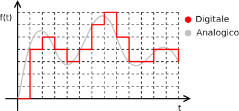

# Trasmissione di dati

## Segnale

Un **segnale** è una entità con cui si sintetizza una informazione per poterla trasmettere attraverso un mezzo di tramsmissione.

Un **segnale elettrico** è una corrente elettrica, in un determinato regime, di cui si varia uno o più suoi aspetti, come corrente e/o tensione, secondo determinate regole in modo da poter rappresentare un'informazione, quindi adempire allo scopo di un segnale. L'insieme delle regole è chiamato **modulazione** (esempio: [FM o *Modulazione di frequenza*](https://it.wikipedia.org/wiki/Modulazione_di_frequenza)), ma tale termine indica anche l'azione che si intraprende sul segnale per modificarlo (esempio: un circuito di modulazione FM).

Ci sono due tipi di segnali e, di paripasso, di trasmissioni:

- **digitali**: i dati sono rappresentati in forma digitale, cioè attraverso numeri codificati in sequenze di bit, per cui un segnale digitale assumerà soltanto valori discreti che descrivono uno o più bit;
- **analogici**: i dati sono codificati in valori elettrici, quindi il segnale potrà assumere qualsiasi valore.

### Segnali digitali

Un **segnale digitale** è un [segnale discreto](https://it.wikipedia.org/wiki/Segnale_discreto) (quindi un segnale che varia in determinati istanti temporali) modulato in modo tale da assumere soltanto determinati valori, solitamente, di tensione, chiamati anche **valori soglia**. Ad ogni valore di tensione è associata un valore binario di uno o più bit, chiamato **parola** o *stringa*. Un segnale digitale contiene sempre almeno una parola. L'associazione valore di tensione - valore binario introduce anche un ordine tra i valori che il segnale può assumere.

Idealmente un segnale digitale ha le seguenti proprietà:

- **tempo di variazione**, cioè tempo impiegato per passare da un valore all'altro, **nullo**. I tempi di variazione di un segnale digitale sono:
  - **tempo di discesa** ($t_f$) o *falling time*: tempo che il segnale impiega a passare da un livello logico a quello inferiore o precedente;
  - **tempo di salita** ($t_r$) o *raise time*: tempo che il segnale impiega a passare da un livello logico a quello superiore o successivo.

  È impossibile, in realtà, che una variazione sia instantanea, e non è detto nemmeno che $t_f$ e $t_r$ siano identici! Inoltre una variazione, in prossimità dei valori di soglia, potrebbe risultare "smussata", cioè non passare in modo lineare da un livello logico ad un altro, ma presentare delle curve in prossimità del livello di partenza e di quello di arrivo, che dipendono solitamente dalla componentistica del circuito digitale.

- **valori di tensione sempre rispettati**, quindi se il segnale assume i valori $0V$, $2.5V$ e $5V$ non accadrà mai che assumerà il valore $4.5V$, ad esempio. Ovviamente un segnale reale è incline a disturbi ed altri fattori che difficilmente lo rendono così stabile da non assumere mai i valori intorno ai valori di tensione prefissati, cioè valori come $4.9V$, $2.78V$ e così via.

Un **segnale digitale binario** è un segnale digitale che può assumere soltanto 2 valori:

- valore **logico alto**, solitamente associato al bit $1$;
- valore **logico basso**, solitamente associato al bit $0$.

Un esempio di segnale digitale binario può essere un segnale che assume soltanto i valori $0V$ e $3.3V$, a cui sono rispettivamente associati i valori logici $0$ ed $1$.

Il **duty cycle** è un importante parametro di un segnale digitale binario: indica, dato un certo periodo di tempo, il rapporto tra il tempo che il segnale ha valore logico alto e quello a valore basso. Esempio: un segnale ha un periodo di $2s$, rimanendo a $5V$ per $0,5s$ e $0V$ per il resto del periodo; il suo sarà un duty cicle del $25\%$. Una modulazione che utilizza questo concetto è la modulazione [PWM](https://it.wikipedia.org/wiki/Pulse-width_modulation).

## Linee di trasmissione

Una **linea di trasmissione** è un dispositivo elettrico che trasportare segnali (in elettronica) od energia (in elettrotecnica) su grandi distanze. Ovviamente le grandi distanze sono in relazione al livello di miniaturizzazione a cui si lavora: a livello di nanometri un conduttore di qualche centimetro è una linea di trasmissione.

Il **ritardo di propagazione** di una linea è il tempo necessario per cui che le caratteristiche di un segnale ad un dato istante si propaghino da un capo all'altro della linea.

Un **protocollo di trasmissione elettrica** è uno standard che descrive la parte elettrica di una linea, quindi tensioni utilizzate, tempistiche, segnali di sincronizzazione, e così via. Per implementare completamente una linea solitamente si associano protocolli di tipo meccanico (che descrivono spinotti, cavi, antenne, ...), elettrico ed informatico: alcune volte tali "scelte" di standard sono racchiuse in standard ben noti, come lo standard [ethernet](https://it.wikipedia.org/wiki/Ethernet) o lo standard [RS-232](https://it.wikipedia.org/wiki/EIA_RS-232).

### Fanomeni parassiti

In base a come è stata costruita bisogna tenere in considerazione diversi **fenomeni parassiti** che possono verificarsi, tra cui:

- **resistenza** dei conduttori, come nel caso di due piste su una PCB doppia faccia;
- **induttanza** tra i conduttori;
- **capacità** dei singoli e tra i conduttori, nel secondo caso dovuta dal materiale che li separa che lavora come dielettrico del condensatore le cui facce sono i conduttori.

Tutte queste cause sono responsabili dei cosiddetti **disturbi**, che generalmente sono

- **cadute di tensione**, cioè variazioni improvvise del segnale non desiderate;
- **attenuazioni** del segnale, cioè diminuzione della differenza tra i valori che il segnale assume o aumento 

Causando:

- **perdita di integrità** dei dati trasmessi
- aumento del **ritardo di propagazione** del segnale

Tutto ciò, in linea di massima, abbassa la **frequenza massima di trasmissione** che la linea riesce a supportare, anche fino a renderla totalmente inutilizzabile. Ad esempio, se una linea usa un protocollo e la smussatura introdotta dalla capacità della linea è troppo alta, può capitare il segnale non riesca mai ad assumere uno qualsiasi  dei valori logici previsti. Ovviamente da ciò si deduce che, in base al tipo di linea di trasmissione, si deve utilizzare il protocollo giusto. Un altro famoso problema è l’effetto **crosstalk**, dovuto principalmente da induttanze o capacità parassite su linee telefoniche che causano la sovrapposizione di due conversazioni, solitamente l'altra in sottofondo alla propria.

Una linea su cui sono stati presi tutti gli accorgimenti per l'utilizzo è detta una linea **compensata** od *accoppiata* ed il processo per renderla tale è chiamato **polarizzazione**.

Ci sono vari metodi per risolvere o attenuare gli effetti di questi problemi. Alcuni metodi diffusi sono:

- **schermatura** che coinsiste nel creare attorno alla linea una capacità che raccolga disturbi da e verso la linea. Tale capacità è collegata a terra ed è solitamente implementata avvolgendo i conduttori con un foglio di materiale conduttore a sua volta. Tale accorgimento però aumenta la capacità complessiva della linea, abbassando ulteriormente le prestazioni di utilizzo.
- [**bilanciamento**](https://en.wikipedia.org/wiki/Balanced_line) della linea.

Ovviamente tali metodi dipendono dall’utilizzo e caratteristiche minime che la linea dovrà avere.
