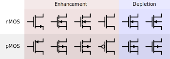

# Semiconduttori

I **semiconduttori** sono materiali artificiali caratterizzati da una resistività intermedia tra i conduttori e gli isolanti e direttamente dipendente dalla temperatura. Le loro caratteristiche elettriche e fisiche sono importanti per determinare il campo di utilizzo.

Il processo per ottenere un semiconduttore è chiamato **drogaggio** e coinsiste nell'inserire in una struttura atomicamente neutra, come il silicio, degli ioni. Se si inseriscono ioni negativi si crea un semiconduttore drogato di **tipo N**, mentre se si inseriscono ioni positivi si crea un semiconduttore drogato di **tipo P**.

## Giunzione P-N

Una **giunzione P-N** è l’area in cui due facce, una di tipo N e l’altra di tipo P, si toccano. Possono essere due fogli di silicio separati o anche due aree sullo stesso foglio.

La regione di confine tra i blocchi di tipo P e di tipo N è detta **regione di carica spaziale** o *di svuotamento*; in quest’area gli elettroni del materiale drogato N, vista la forte attrazione esercitata dal materiale di tipo P, si diffondono nel semiconduttore adiacente, generando una **corrente di diffusione**. Nel passaggio lasciano delle lacune nel materiale di tipo N, che esercitano a loro volta una forza che cerca di ri-attrarli. Quando le due forze si equivarranno ci sarà un addensamento di elettroni nella parte del materiale di tipo P adiacente alla giunzione manifestando le forze in equilibrio con una tensione costante chiamata **tensione di soglia** $V_{BIAS}$ ([​:laughing:​](http://vbias.com/ "La disperazione")) . La larghezza della zona di carica spaziale non è detto che sia la stessa per oguno dei due blocchi ed è inversamente proporzionale al drogaggio di ognuno di essi. Di sua natura la regione di svuotamento è come un condensatore, ma nel condensatore non c’è passaggio di elettroni.

**Polarizzare** una giunzione p-n significa applicargli una tensione. In base al verso della tensione possiamo dire che la polarizzazione è:

- **diretta**: il generatore di tensione ha collegati polo positivo con il materiale di tipo P e polo negativo con il materiale di tipo N. In questo caso la forza di attrazione esercitata dal polo positivo della batteria sugli elettroni presenti nel materiale $P$ e la forza di repulsione esercitata dagli elettroni immessi nel materiale di tipo N permette, se generata da una tensione più alta, di vincere la tensione di soglia, ottenendo quindi una corrente con f.e.m. pari a quella generata da  $V= V_{IN} - V_{BIAS}$. Il suo comportamento è quindi lo stesso di un generatore di tensione $V_{BIAS}$ con verso contrario al flusso della corrente;
- **inversa**: la regione di carica spaziale si ingrandisce ulteriormente, alzando la tensione di soglia e rendendo impossibile il passaggio di correnti fino ad una **tensione di rottura** dopo il quale la giunzione risulta danneggiata e funziona come un cortocircuito.

==TODO==: inserire una imagine che faccia vedere i circuiti di polarizzazione ed i loro circuiti equivalenti.

### Diodo

Il diodo è la più semplice delle giunzioni, in quanto è fatto proprio come una giunzione p-n. È composto da:

- **giunzione p-n**;
- **anodo** ($A$): punto in cui entra la corrente, collegato all’area drogata P;
- **catodo** ($K$): punto in cui esce la corrente, collegato all’area drogata N.

Ci sono vari tipi di diodi:

- **classico**: permettere il passaggio di corrente in un unico determinato verso, bloccando quindi correnti di verso opposto. Il verso è indicato dal simbolo, interpretato come freccia;
- **schottky**: ha una $V_{BIAS}$ circa la metà del diodo tradizionale e tempi di commutazione brevissimi;
- **zener**: diversamente dal classico tollera una corrente inversa;
- **led** o *light emitting diode*: in un diodo è possibile che alcuni elettroni non saltino dal materiale $N$ al $P$, ma emettono la loro energia sottoforma di *fotone*. Drogando quindi nel giusto modo è possibile accentuare tale effetto, ottenendo così un diodo emettitore di luce. Sono caratterizzati da $V_{BIAS}$ alte ( $1V \sim 3V$) che dipendono dal colore che emettono. Solitamente per evitare che si brucino e per ottenere pìu intensità luminose possibili, sono gestiti in PWM, con la possibilità di utilizzare correnti un po' più alte della corrente limite in caso di duty cicle ridotto.

Il **diodo reale**, in situazione di conduzione, corrisponde ad un generatore di tensione $V_{BIAS}$, di verso contrario a quello della corrente che attraversa il circuito, con una resistenza $R_D$ in serie, il cui valore è nell'ordine delle decine di $\Omega$.

La componente resistiva indica che il diodo è comunque soggetto ad un effetto Joule che ne determina una corrente massima in conduzione, pena la rottura dello stesso.

## Transistor

Un transistor è un componente triplare, composto da più giunzioni p-n, che permette di **pilotare una corrente** (cambiarne valori come tensione o corrente) **con un'altra corrente**, solitamente più piccola di quella da pilotare.

Esistono principalmente due diversi tipi di transistor, il **transistor a giunzione bipolare (BJT)** ed il **transistor ad effetto di campo (MOS)**.

### BJT

Il **transistor BJT** è nato poco dopo il diodo, è un dispositivo *pilotato in corrente*; ciò significa che permette di modulare una corrente variando l'ampiezza del flusso di corrente di controllo. I suoi terminali sono chiamati **collettore** ($C$), **emettitore** ($E$) e **base** ($B$).

Esistono due tipi di transistor BJT: BJT **PNP** e BJT **NPN**. Queste, come si intuisce dal nome, differiscono per la combinazione di materiali drogati utilizzati per costruire le due giunzioni che compongono il transistor. In base alla combinazione cambia il verso delle correnti che attraversano il BJT, che assumeranno il verso della freccia indicata nei loro relativi simboli, influendo sul modo in cui dovranno essere polarizzat.

Possiamo quindi definire le funzioni dei terminali del transistor come segue:

- Transistor NPN: collegato il più possibile **vicino alla massa**. I terminali sono collegati come segue:
  - collettore ed emettitore: terminali da cui la corrente da controllare, creata dalla tensione $V_{CE}$, rispettivamente entra ed esce. $C$, quindi, è collegato ad un potenziale più alto di $D$;
  - base: polo da cui entra la corrente di controllo $I_B$, creata dalla tensione $V_{BE}$.
- Transistor PNP: collegato il più possibile **vicino alla tensione di alimentazione**. I terminali sono collegati come segue:
  - collettore ed emettitore: terminali da cui la corrente da controllare, creata dalla tensione $V_{EC}​$, entra ed esce;
  - base: polo da cui entra la corrente di controllo $I_B$, creata dalla tensione $V_{BC}$.

Si deve porre attenzione al verso delle correnti, in quanto non è possibile invertirlo.

Il transistor BJT può assumere i seguenti stati di funzionamento:

- **interdizione**: in assenza di corrente $I_B$ si comporta come un tasto aperto, tale per cui $V_{CE} = 0$;
- **conduzione**: ==TODO==;
- **saturazione**: la $I_B$ ha raggiunto il valore massimo possibile e si comporta come un tasto chiuso, per cui $V_{CE} = V_{DD}$.

Si può dedurre che il BJT **necessita continuamente di una corrente** $I_B$ per poter condurre, inficiando sui consumi e problemi relativi all'effetto Joule, quindi anche sulla possibilità di miniaturizzazione.

I BJT sono stati rimpiazzati dai MOS quasi del tutto oramai, ma sono utilizzati ancora in particolari campi come quelli dove è richiesta molta velocità di switching o per matching di sistemi differenti. Sono intrinsecamente meno rumorosi dei MOS.

### MOS

Il **transistor MOS** o *transistor MOSFET*, ovvero *transistor metallo-ossido-semiconduttore ad effetto di campo*, è un dispositivo a 4 terminali, composto da uno strato di materiale semiconduttore drogato chiamato **body** ($B$) o *bulk* o *substrato*, solitamente il silicio, di cui due sue parti chiamate **source** ($S$) e **drain** ($D$) hanno un drogaggio opposto e sono collegate alla corrente da pilotare $I_{DS}$, generata dalla tensione $V_{DS}$. Il tipo di drogaggio di $B$, e quindi di $S$ e $D$, identifica anche il **tipo di MOS**, individuandone così due possibili tipi:

- **pMOS**: con $B$ di tipo N ed $S$ e $G$ di tipo P;
- **nMOS**: con $B$ di tipo $P$ ed $S$ e $G$ di tipo N.

Il tipo di MOS determina anche il verso di $I_{DS}$ dipende dal tipo di MOS, in quanto cambiano i circuiti di polarizzazione con cui si utilizza il MOS.

Il MOS espone anche un altro terminale, il **gate** ($G$), collegato ad uno strato di conduttore, a sua volta separato da $B$ con uno strato di materiale isolante ad alta [permittività](https://it.wikipedia.org/wiki/Permittivit%C3%A0_elettrica) (quindi molto buono, solitamente **ossido** di silicio ). La struttura $G$-ossido-$B$ è, in pratica, un condensatore con $G$ e $B$ come armature e l'ossido come dielettrico, ed è infatti chiamata **condensatore (del) MOS** (*MOS capacitor*).

#### Polarizzazione

Essendo il MOS un dispositivo **pilotato in tensione**, tra $G$ ed $B$ è possibile applicare una tensione $V_{GB}$ che permette di controllare la corrente $I_{DS}$. Modulare la tensione $V_{GB}$ significa polarizzare il condensatore MOS, ed in base a com'è polarizzato cambia la carica elettrica di $B$, soprattutto in prossimità superficie di giunzione ossido-$G$. In base alla carica elettrica della zona ossido-$G$ si instaurano diverse **regioni** o *aree* nel semicondutture, come la [regione di svuotamento del diodo](#diodo), che determinano la modalità di funzionamento del transistor, chiamata solitamente **modalità del MOS**. Ricapitolando, ad ogni regione che si crea in prossimità della giunzione ossido-$G$ corrisponde un diverso funzionamento del MOS.

Nella maggiorparte dei transistor utilizzati in laboratorio $B$ è cortocircuitato ad $S$, per cui è solito riferirsi a $V_{BS}$ con il simbolo $V_{GS}$. L'utilizzo di $B$ ed $S$ a diversi potenziali è solito nei circuiti [VLSI](https://it.wikipedia.org/wiki/Very_large_scale_integration).

La seguente spiegazione di funzionamento del MOS prende in esame un nMOS con $B$ ed $S$ cortocircuitati. In base a $V_{GS}$ si creano le regioni di:

- **accumulazione** con $V_{GS} \le 0$: i pochi elettroni del substrato in prossimità della superfice ossido-$B$ sono respinti, per cui in quell'area si accumulano lacune. Il transistor è in uno stato di **interdizione**: qualsiasi sia la $V_{DS}$ non vi sarà passaggio di elettroni da $D$ ad $S$;
- **svuotamento** o *depletion* con $0 < V_{GS} \le V_{th}; V_{th} > 0$: alcuni elettroni sono attrati vicino alla superfice di giunzione ossido-$B$. Tali elettroni colmano alcune delle lacune dell'area, instaurando quindi una *regione di svuotamento*. Quando $V_{GS} = V_{th}$ le lacune della superfice sono tutte colmate, quindi gli atomi dell'area sono tutti neutri ma, non avendo questi nessun elettrone libero, non può passare nessuna corrente, per cui il transistor è comunque in uno stato di interdizione. $V_{th}$ è una tensione ben nota nelle caratteristiche di un transistor;
- **inversione** o *conduzione* con $V_{GS} > V_{th}; V_{th} > 0​$: in prossimità della superficie di giunzione ossido-$G​$ saranno presenti elettroni liberi, delimitando un'area chiamata **canale** in cui $B​$ sarà un semiconduttore di tipo N, quindi si ha una *inversione di drogaggio*. Ora tra $D​$ ed $S​$ si può instaurare una corrente, in quanto gli elettroni liberi di $D​$ possono riversarsi fino ad $S​$ ed il MOS è in uno stato di **conduzione**.

Una volta che il MOS è in conduzione, l'entità della corrente $I_{DS}$ dipende da $V_{DS}$ e da $V_{GS}$. In base a questi due valori il comportamento del MOS può essere sintetizzato con due diversi dispositivi elettrici. Si identificano quindi i **regimi di lavoro** (chiamati anche *regioni di lavoro* in quanto sono rappresentate in due regioni diverse del grafico che descrive il MOS):

- **lineare** od *ohmica* con $V_{DS} < V_{GS} - V_{th}$: il canale, quindi il MOS, si comporta come una **resistenza** di valore proporzionale a $V_{GS}$;
- **saturazione**: $V_{DS} \ge V_{GS} - V_{th}$.  Quando $V_{DS} = V_{GS} - V_{th}$ si verifica il fenomeno di **pinch-off**, secondo il quale il canale si strozza in prossimità di $D$. Tale strozzatura si accentua ancora di più, indietreggiando verso $S$, in modo direttamente proporzionale alla differenza tra $V_{GS}$ e $V_{DS}$. Il risultato è che $I_{DS}$ rimane praticamente costante al valore che ha assunto nel punto di pinch-off point, per cui il transistor lavora come un **limitatore di corrente** il cui $I_{max}$ dipende da $V_{GS} - V_{th}$.

Si noti che il valore $V_{GT} = V_{GS} - V_{th}$ può essere considerato un indice di quando sia facile mettere un certo MOS in stato di saturazione.

Visto che la polarizzazione del MOS avviene come la polarizzazione di un condensatore, vi sono delle conseguenze:

- **annullamento del consumo** in regime **statico**: la carica $G$ non varierà molto nel tempo, quindi lo stato di conduzione od interdizione del MOS rimane lo stesso soltanto "rinfrescando" la carica di $G$, cioè sottoponendo saltuariamente il condensatore MOS alla tensione $V_{GS}$. Questo differisce dalla polarizzazione del BJT, ove è necessario fornire costantemente una corrente per mantenerlo in conduzione;
- **maggiore lentezza di commutazione** sia dello stato del canale, sia della $I_{DS}$, rispetto ai BJT.

L'ordine della capacità del condensatore MOS è dei $fF$ ($femtoFarad = 10^{-15}F$);

#### Caratteristiche del MOS reale

Il MOS reale presenta alcuni *fenomeni parassiti*:

- **capacità del condensatore MOS**. La sua entità dipende da vari fattori, per via di forze che lo caraterizzano come l'attrazione del canale esercitata sulle lacune di $G$. Generalmente questa è la capacità parassita di maggior entità nel MOS e la sua entità varia in base a $V_{GS}$, per cui è anche difficile prevederne gli effetti. Modellato come un condensatore tra $G$ e $B$;
- **capacità tra $D$ e $B$ e tra $S$ e $B$** dovute dal tempo di redistribuzione delle cariche delle giunzioni $D-B$ e $S-B$. Modellato con dei condensatori;
- **resistenza di canale**. Tale resistenza dipende dalla costituzione del transistor e la sua forma, a parità di materiale e tensioni di utilizzo, è decisiva sulla sua resistenza. Modellata come una resistenza tra $D$ e $S$, presente solo quando il MOS è in conduzione ed il cui valore varia in base a $V_{GT}$, quando il MOS è in regime lineare, ed in base a $V_{DS}$ quando è in regime di saturazione;
- **corrente di perdita** molto piccola attraverso l'**ossido**. Questa corrente fa si che la carica del condensatore MOS si annulli dopo un certo periodo di tempo. Modellata come una resistenza molto grande tra $G$ e $B$;
- **corrente di perdita tra $D$ e $S$** quando il MOS è interdetto, quindi quando non c'è alcun canale. Modellata come una resistenza molto grande tra $D$ e $S$, presente solo quando il MOS è in interdizione.

In *regime statico* i comportamenti parassiti evidenti saranno soltanto la resistenza di canale e le correnti di perdita, che porteranno ad una interdizione del MOS dopo un po' che è lasciato stare senza $V_{GS}$.

In *regime dinamico* entrano in gioco anche le capacità, instaurando insieme alle resistenze una rete RC. Questo implica che il segnale elaborato MOS soffrirà di:

- **ritardo di variazione dello stato del canale** dovuto dal tempo impiegato dal condensatore MOS nel variare la sua carica;
- **ritardo di variazione della corrente $I_{DS}$** dovuto dalle capacità $D-B$ ed $S-B$.

#### Scaling

Per quanto riguarda lo *scaling* il MOS riesce ad essere **intrinsecamente più piccolo** del BJT e, solitamente, per diminuire dimensioni e consumi di un MOS ci si concentra su questi parametri:

- **lunghezza del canale**, quindi distanza tra $D$ ed $S$. È il parametro che indica la miniaturizzazione dei microprocessori ed attualmente si è intorno ai $18nm$, che corrispondono a circa $50$ atomi di silicio. Diminuire eccessivamente la lunghezza del canale però può comportare una conduzione per diffusione anche se il canale non è presente. Ovviamente più il canale è corto, minore è la $V_{th}$ e quidi minori sono i consumi;
- **spessore dell'ossido** e, di paripasso, il materiale utilizzato per lo strato di ossido. Essendo l'ossido parte del dielettrico del condensatore MOS (l'altra parte di dielettrico è la zona di svuotamento, che dipende da $V_{GS}$) valgono i limiti di scaling di un condensatore normale, cioè un dielettrico meno spesso indica una maggiore capacità, per cui occorre una minore tensione per "intrappolare" la stessa quantità di cariche, quindi la $V_{th}$ è più bassa. Però più il dielettrico è sottile, più grandi sono le correnti di perdita e, di conseguenza, i consumi.

Un altro fattore che altera la $V_{th}$ è l'**effetto body**. Soprattutto in circuiti [VLSI](https://it.wikipedia.org/wiki/Very_large_scale_integration), ma generalmente in ogni circuito composto da più MOS che condividono tutti lo stesso $B$ come nei microcontrollori, non è possibile cortocircuitare $S$ e $B$, altrimenti si avrebbero le $S$ di tutti i transistor in parallelo tra loro. Inoltre per minimizzare le correnti di perdita e migliorare la stabilità del MOS, per l'nMOS si preferisce collegare $B$ al potenziale più basso presente in tutto il circuito. Non essendo $S$ e $B$ allo stesso potenziale si potrebbe creare una tensione $V_{BS}$ che altera la regione di svuotamento tra ossido (e canale, se presente) e $B$, richiedendo quindi una maggiore $V_{GS}$ per formare il canale, quindi aumenta la $V_{th}$. Per il pMOS la spiegazione è duale.

Nei MOS d'oggi la $V_{th}$ è solitamente sintorno ai 0,85V.

#### Altri tipi di MOS e simboli

Oltre alla divisione per pMOS ed nMOS, i MOS sono divisi in :

- **MOS ad arricchimento** o *enhancement MOS*: è il tipo di MOS che abbiamo trattato. Tale MOS si arricchisce di cariche in prossimità della giunzione ossido-$B$ all'aumentare di $V_{GS}$, per cui se non è polarizzato non c'è alcun canale;
- **MOS a svuotamento** o *depletion MOS*: presenta già un canale se non è polarizzato, creato durante la fabbricazione attraverso un diverso drogaggio rispetto a quello del MOS ad arricchimento. È possibile polarizzarlo sia per aumentare lo spessore del canale già presente con $V_{GS} > 0$, sia per interdirlo con $V_{GS} < 0$.

Infine il **simbolo del MOS** non è unico, ma varia in base al tipo di MOS ed allo stile.

Il **pallino**, in elettronica, è un simbolo per indicare la negazione di un segnale. Infatti il pMOS ha bisogno di una corrente negativa per aprire il canale, per cui nel simbolo il segnale $V_{GS}$, prima di collegarsi al gate, è preceduto da un pallino.

#### Note pratiche di utilizzo del MOS

Teoricamente un pMOS può essere usato come un nMOS invertendo i collegamenti. In realtà ci possono essere ottimizzazioni fisiche delle componenti tali per cui potrebbe non essere possibile.
