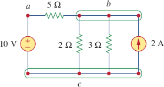
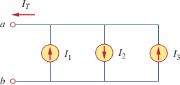

# Topologia di un circuito

Definizoni base:

- **rete**: una serie di dispositivi collegati tra loro;
- **maglia**: percorso chiuso in una rete;
- **circuito**: una rete chiusa, anche a formare più anelli;
- **ramo**: un singolo elemento;
- **nodo**: punto di incontro tra rami. Indicati nel circuito in figura come *a*, *b* e *c* sono considerati come nodo unico se non ci sono rami tra loro.

**Configurazioni** di rami in:

- **serie**: i rami sono connessi a catena, quindi il nodo finale di uno è il nodo iniziale dell'altro, tranne per il primo ed ultimo nodo della rete, che sono scollegati. La corrente passante è la stessa per tutta la parte di rete;
- **parallelo**: i rami condividono il nodo di inizio e quello di fine. La tensione ai capi di ogni ramo è la stessa.

Nella figura le resistenze da 2$\Omega$ e da 3$\Omega$ ed il generatore di corrente sono in parallelo tra loro, ma sono a loro volta in serie alla resistenza da 5$\Omega$.

# Teoremi sui circuiti

## Leggi di Kirchhoff

Legge di Kirchhoff **ai nodi**: per ogni nodo la somma delle correnti entranti è uguale alla somma di quelle uscenti. Ad esempio, nel circuito seguente, grazie alla legge ai nodi possiamo dire che:

$$I_t = I_1 + I_3 - I_2$$

Legge di Kirchhoff **alle maglie**: ina una maglia la somma dei voltaggi generati è uguale alla somma delle cadute di tensione.